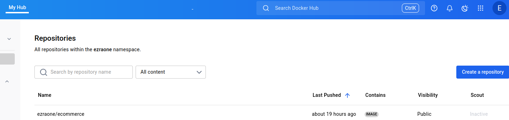

# CI/CD Pipeline for Web Application Deployment Using Jenkins & Docker

This project demonstrates how to design and implement a robust CI/CD pipeline using Jenkins to automate the deployment of a web application.

---

## 📚 Prerequisites

- Jenkins essentials
- Docker fundamentals
- Git/GitHub integration

---

## 🧩 Project Components

## Jenkins Server Setup

**Objective**: Configure Jenkins for CI/CD automation.

## 🖥️ 1. Install Jenkins on a Dedicated Server or VM

#### ✅ Supported Platforms
- Ubuntu/Debian
- CentOS/RHEL
- Windows Server

### 🔧 Installation Steps (Ubuntu Example)

```bash
# Update system
sudo apt update

# Install Java (Jenkins requires Java)
sudo apt install openjdk-11-jdk -y

# Add Jenkins repository and key
wget -q -O - https://pkg.jenkins.io/debian-stable/jenkins.io.key | sudo apt-key add -
sudo sh -c 'echo deb https://pkg.jenkins.io/debian-stable binary/ > /etc/apt/sources.list.d/jenkins.list'

# Install Jenkins
sudo apt update
sudo apt install jenkins -y

# Start and enable Jenkins
sudo systemctl start jenkins
sudo systemctl enable jenkins
```

---

## 🔗 2. Source Code Management Integration with GitHub

This section explains how to connect Jenkins to a GitHub repository and configure webhooks to automatically trigger builds when code changes are pushed.

---

### 🧰 1. Integrate Jenkins with GitHub

### 🔧 Integration Steps

1. **Create a Jenkins Job**
   - Go to **Jenkins Dashboard → New Item**
   - Choose **Freestyle Project** or **Pipeline**
   - Name your job and click **OK**

2. **Configure Git Repository**
   - In the job configuration:
     - Scroll to **Source Code Management**
     - Select **Git**
     - Enter your GitHub repository URL:
       ```
       https://github.com/<your-username>/<your-repo>.git
       ```
     - If the repo is private, add credentials:
       - Click **Add → Jenkins**
       - Choose **Username/Password** or **Personal Access Token**
       - Save and select the credential

3. **Specify Branch**
   - Under **Branches to build**, enter:
     ```
     */main
     ```
     Or replace `main` with your default branch name

---

## 🔔 3. Configure GitHub Webhooks

#### 📦 Purpose

Webhooks notify Jenkins when code is pushed, triggering an automated build.

### 🔧 Setup Steps

1. **Get Jenkins Webhook URL**

    **Note:** Use the ngrok configured IP as *your-jenkins-server*

   - Format:
     ```
     http://<your-jenkins-server>/github-webhook/
     ```
   - Example:
     ```
     http://192.168.1.100:8080/github-webhook/
     ```

2. **Add Webhook in GitHub**
   - Go to your GitHub repository
   - Click **Settings → Webhooks → Add webhook**
   - Enter the Jenkins webhook URL
   - Set **Content type** to `application/json`
   - Choose **Just the push event**
   - Click **Add webhook**

3. **Enable Build Trigger in Jenkins**
   - In your Jenkins job configuration:
     - Scroll to **Build Triggers**
     - Check **GitHub hook trigger for GITScm polling**

---

### 🧰 For Freestyle Job in Jenkins

1. **Create a New Job**
   - Go to **Jenkins Dashboard → New Item**
   - Enter a name (e.g., `webapp-build-test`)
   - Select **Freestyle Project**
   - Click **OK**

2. Follow directions in the **Create a Jenkins Job** section above.

3. **Do a git push**
---

### For Jenkins Pipeline

1. **Create a New Job**
   - Go to **Jenkins Dashboard → New Item**
   - Enter a name (e.g., `webapp-build-test`)
   - Select **Pipeline**
   - Click **OK**

2. Follow directions in the **Create a Jenkins Job** section above.

3. Create Jenkins file (scrpt) in the project directory like the one below.

### 🧪 Sample Jenkinsfile

```groovy
pipeline {
    agent any

    stages {
        stage('Checkout Code') {
            steps {
                git url: 'https://github.com/your-username/your-repo.git', branch: 'main'
            }
        }

        stage('Login to DockerHub') {
            steps {
                script {
                    withCredentials([
                        usernamePassword(
                            credentialsId: 'dockerhub-creds',
                            usernameVariable: 'DOCKERHUB_USER',
                            passwordVariable: 'DOCKERHUB_PASSWORD'
                        )
                    ]) {
                        sh 'echo $DOCKERHUB_PASSWORD | docker login -u $DOCKERHUB_USER --password-stdin'
                    }
                }
            }
        }

        stage('Build Docker Image') {
            steps {
                sh 'docker build -t yourusername/webapp .'
            }
        }

        stage('Run Container') {
            steps {
                sh 'docker run -d --name webapp-container -p 8080:80 yourusername/webapp'
            }
        }

        stage('Push to DockerHub') {
            steps {
                sh 'docker push yourusername/webapp'
            }
        }
    }
}
```

3. **Do a git push**
---

## 4. Docker Image Creation and Registry Push

On successful deployment, the image is pushed to Docker Registry (Docker Hub).



## 5. Test the Site

- Run
```sh
docker run -d -p 8001:80 --name ez-ecomm ecommerce
```

- Access the site via `http://localhost:8001`


---

